# Phase 1 — Domain Model, ER Diagram & Database Schema

> Read `00-master-plan.md` first. This phase defines the domain and the PostgreSQL
> schema. The catalog gets the most detail because it is the platform's core
> differentiator.

---

## 1. Store / scope foundation (every other table hangs off this)

```
website (1) ──< store (1) ──< store_view
                                   │
   language, currency, theme, root_category live on the right level
```

### Tables

**`website`**
| col | type | notes |
|-----|------|-------|
| id | BIGINT PK | identity |
| public_id | UUID | v7, external |
| code | CITEXT UNIQUE | e.g. `us_retail` |
| name | TEXT | |
| base_currency | CHAR(3) | FK → currency |
| default_store_id | BIGINT NULL | FK → store (deferred) |
| is_default | BOOLEAN | exactly one true (partial unique idx) |
| created_at/updated_at/created_by/updated_by/deleted_at | — | audit + soft delete |

**`store`** (Magento "store group")
| col | type | notes |
|-----|------|-------|
| id | BIGINT PK | |
| website_id | BIGINT FK → website | ON DELETE RESTRICT |
| code | CITEXT | UNIQUE (website_id, code) |
| name | TEXT | |
| root_category_id | BIGINT FK → category | catalog root for this store |
| default_store_view_id | BIGINT NULL FK → store_view | |
| audit + soft delete | | |

**`store_view`**
| col | type | notes |
|-----|------|-------|
| id | BIGINT PK | |
| store_id | BIGINT FK → store | |
| code | CITEXT | UNIQUE (store_id, code) |
| language_id | BIGINT FK → language | |
| currency | CHAR(3) FK → currency | display currency |
| theme_id | BIGINT NULL FK → theme | different theme per store view |
| is_rtl | BOOLEAN | derived from language but overridable |
| sort_order | INT | |
| status | store_view_status | active/inactive |
| audit + soft delete | | |

**`language`** (`id, code (BCP-47), name, native_name, is_rtl`),
**`currency`** (`code CHAR(3) PK, symbol, minor_units, name`),
**`theme`** (`id, code, name, config JSONB`).

> **Why explicit tables (vs Magento `store_id=0`):** every scoped value FK-references
> a real `store_view_id`/`store_id`/`website_id`, and `GLOBAL` scope is represented
> by `NULL` + `scope='GLOBAL'`. No magic numbers, FK integrity enforced, and the
> planner gets real statistics.

### The universal scope pattern

Any overridable value table carries:
```
scope           scope_enum           -- GLOBAL|WEBSITE|STORE|STORE_VIEW
website_id      BIGINT NULL
store_id        BIGINT NULL
store_view_id   BIGINT NULL
CHECK (scope-consistent: exactly the right *_id set for the scope)
UNIQUE (<entity_id>, <attribute_id>, scope, website_id, store_id, store_view_id)
```
One resolver service walks `STORE_VIEW → STORE → WEBSITE → GLOBAL` and is unit-tested
once, reused by pricing, attribute values, CMS, SEO, config.

---

## 2. Catalog — Attribute Set System (modernized EAV)

### 2.1 Entities

```
attribute_set ──< attribute_set_group ──< attribute_set_attribute >── attribute ──< attribute_option
     │                                                                     │
 product.attribute_set_id ──────────────────────────────────────────── value tables (typed, scoped)
```

**`attribute`** — the reusable definition (Brand, RAM, Color…)
| col | type | notes |
|-----|------|-------|
| id | BIGINT PK | |
| code | CITEXT UNIQUE | `ram`, `display_size` |
| label | TEXT | translatable via `attribute_label` |
| data_type | attribute_data_type | see type list below |
| input_type | attribute_input_type | text/select/multiselect/color/… |
| is_required | BOOLEAN | |
| is_searchable | BOOLEAN | feed to OpenSearch |
| is_filterable | BOOLEAN | layered navigation facet |
| is_comparable | BOOLEAN | compare table |
| is_sortable | BOOLEAN | PLP sort option |
| is_visible_pdp | BOOLEAN | |
| is_visible_plp | BOOLEAN | |
| used_in_search | BOOLEAN | full-text weight |
| used_in_layered_nav | BOOLEAN | |
| is_variant_forming | BOOLEAN | drives configurable variants |
| scope | attribute_scope | GLOBAL/WEBSITE/STORE_VIEW — the *max* scope granularity allowed |
| validation_rules | JSONB | regex, min/max, length, etc. |
| default_value | JSONB | |
| placeholder | TEXT | |
| tooltip | TEXT | |
| is_translatable | BOOLEAN | |
| reference_type | reference_kind NULL | for Reference* types: product/category/brand/cms/collection/customer |
| audit + soft delete | | |

**`attribute_data_type`** enum — covers your full list:
`TEXT, TEXTAREA, NUMBER, DECIMAL, BOOLEAN, DATE, DATETIME, COLOR, SELECT,
MULTISELECT, IMAGE, FILE, URL, EMAIL, PHONE, JSON, RICHTEXT, REF_PRODUCT,
REF_CATEGORY, REF_BRAND, REF_CMS, REF_COLLECTION, REF_CUSTOMER`.

**`attribute_option`** — for SELECT/MULTISELECT/COLOR
`id, attribute_id FK, value TEXT, label TEXT (translatable), swatch (hex/image ref), sort_order`.

**`attribute_label`** — translations
`id, attribute_id FK, store_view_id FK, label TEXT` (UNIQUE attribute_id+store_view_id).

**`attribute_set`** — the template a product belongs to (Electronics, Apparel, Furniture)
`id, code, name, is_default BOOLEAN`.

**`attribute_set_group`** — Magento "attribute group" (General, Specifications, Connectivity…)
`id, attribute_set_id FK, name, sort_order`.

**`attribute_set_attribute`** — junction: which attributes, in which group, in this set
`id, attribute_set_id FK, group_id FK, attribute_id FK, sort_order, is_required_override BOOLEAN NULL`
UNIQUE (attribute_set_id, attribute_id).

> This is what lets **"every attribute set have completely different attributes"**:
> the set curates attributes into groups; the product references the set.

### 2.2 Typed, scoped value tables (the modern EAV core)

Instead of Magento's `catalog_product_entity_varchar/int/decimal/text/datetime`,
we keep the type-partitioned idea (it's actually good for indexing) but make each
**scoped** and **lean**:

**`product_attribute_value`** — the *dispatch* table + generic path
| col | type | notes |
|-----|------|-------|
| id | BIGINT PK | |
| product_id | BIGINT FK → product | |
| attribute_id | BIGINT FK → attribute | |
| scope, website_id, store_id, store_view_id | scope pattern | |
| value_text | TEXT NULL | for TEXT/TEXTAREA/URL/EMAIL/PHONE/COLOR/RICHTEXT |
| value_int | BIGINT NULL | NUMBER, BOOLEAN(0/1), option_id for SELECT, ref id for REF_* |
| value_decimal | NUMERIC(18,4) NULL | DECIMAL |
| value_datetime | TIMESTAMPTZ NULL | DATE/DATETIME |
| value_json | JSONB NULL | JSON, MULTISELECT (array of option ids), FILE/IMAGE metadata |
| UNIQUE (product_id, attribute_id, scope, website_id, store_id, store_view_id) | | |

**Indexing for layered navigation** (the point of all this):
- `(attribute_id, value_int)` partial `WHERE value_int IS NOT NULL` — facet by option.
- `(attribute_id, value_decimal)` — range facets (price-like numeric attrs).
- GIN on `value_json` for multiselect membership.
- `(product_id)` for PDP hydration.

> **Design note:** we keep *one* value table with nullable typed columns rather than
> six tables. At 5M products the row is narrow, only one typed column is populated,
> and per-`attribute_id` partial indexes give us the same selectivity Magento's split
> tables give — with far simpler joins on the PDP (one table, not five). If a single
> attribute becomes pathologically hot, we can promote it to a materialized column.
> The **authoritative facet path is OpenSearch anyway** (Phase 6); the DB is truth.

### 2.3 Metafields (Shopify-style long tail)

**`metafield_definition`**
`id, owner_type (product/variant/category/customer/order/…), namespace, key,
data_type, validation JSONB, scope, is_visible, group_name, sort_order`
UNIQUE (owner_type, namespace, key).

**`metafield_value`**
`id, definition_id FK, owner_id BIGINT, scope+website/store/store_view,
language_id NULL, value JSONB, version INT`
UNIQUE (definition_id, owner_id, scope, store_view_id, language_id).

> Namespace + key + JSONB + scope + language + versioning = your full metafield
> requirement (Material Guide, Warranty PDF, YouTube, AR Model, FAQs, Specs JSON).
> **Versioning:** each edit inserts a new `metafield_value` row with `version+1`;
> the highest version per (definition, owner, scope) is "current".

**When attribute vs metafield?**
- Filterable / sortable / faceted / variant-forming / comparable → **attribute**.
- Free-form, presentational, per-product one-off, no querying → **metafield**.

---

## 3. Catalog — Products & Variants

**`product`** (typed core)
| col | type | notes |
|-----|------|-------|
| id | BIGINT PK | |
| public_id | UUID v7 | |
| type | product_type | simple/configurable/bundle/digital/virtual |
| sku | CITEXT UNIQUE | |
| attribute_set_id | BIGINT FK | |
| status | product_status | draft/active/archived |
| visibility | product_visibility | not_visible/catalog/search/both |
| tax_class_id | BIGINT FK → tax_class | |
| weight | NUMERIC(12,4) NULL | |
| is_digital / is_virtual | BOOLEAN | |
| has_variants | BOOLEAN | |
| created_at/updated_at/created_by/updated_by/deleted_at | audit + soft delete | |

Name/description are **scoped attributes** (translatable) — not columns — so they
localize per store view. (A denormalized `name` copy can be cached for admin lists.)

**`product_store` / visibility per store** — `product_store_view`
`product_id, store_view_id, is_visible, status_override` — **different catalog
visibility per store** requirement. Absence = inherit.

**`product_variant`**
| col | type | notes |
|-----|------|-------|
| id | BIGINT PK | |
| product_id | BIGINT FK (parent) | |
| sku | CITEXT UNIQUE | |
| barcode | TEXT NULL | |
| weight | NUMERIC(12,4) NULL | |
| position | INT | |
| status | variant_status | |
| deleted_at | soft delete | |

**`variant_axis_value`** — which variant-forming attribute options define this variant
`variant_id FK, attribute_id FK, option_id FK` UNIQUE (variant_id, attribute_id).
(e.g. Variant = {Color: Red, Size: L, Storage: 256GB}.)

Variant **price** → Pricing tables (§ Pricing). Variant **inventory** → Phase 7.
Variant **images** → `product_media` scoped to variant.

**`product_bundle_item`** (bundle type)
`id, bundle_product_id FK, group_label, component_product_id FK, qty, is_optional,
price_type (fixed/dynamic), user_defined_qty BOOLEAN, sort_order`.

**Product relations** — `product_link`
`id, product_id FK, linked_product_id FK, link_type (related/cross_sell/up_sell), position`.

**Product ↔ Category** — `product_category`
`product_id, category_id, position` (position = manual sort within category).

**Digital delivery** — `product_download`
`id, product_id/variant_id, media_asset_id, max_downloads, expiry_days`.

---

## 4. Categories / Collections

**`category`** — unlimited hierarchy via **materialized path + closure table** (both:
path for display/sort, closure for fast subtree queries).
| col | type | notes |
|-----|------|-------|
| id | BIGINT PK | |
| parent_id | BIGINT NULL FK | |
| path | LTREE | `1.4.9` materialized path |
| type | category_type | manual / dynamic (rule-based) |
| landing_page_cms_id | BIGINT NULL | landing page |
| sort_mode | enum | position/name/price/newest |
| audit + soft delete | | |

**`category_closure`** — `ancestor_id, descendant_id, depth` (fast "all products in
subtree" and breadcrumb queries; LTREE `@>` is the alternative, keep both options).

Category **name/description/SEO/images** are scoped attributes / metafields +
`category_media`. **Store-specific visibility:** `category_store_view(category_id,
store_view_id, is_visible)`.

**Dynamic collections** — `category_rule`
`category_id, rule JSONB (condition tree), match_type (all/any)`. A BullMQ job
materializes matches into `product_category` (with a `is_dynamic` flag) so browse
stays fast; re-evaluated on product change events.

---

## 5. Media

**`media_asset`** (registry; bytes live in MinIO/S3)
`id, public_id, storage_key, mime_type, bytes, width, height, duration, checksum,
alt_default, kind (image/video/document/model3d), created_by, deleted_at`.

**`media_transform`** — derived renditions `asset_id, variant (thumb/…), storage_key, w, h`.

**`product_media`** — link + ordering + scope
`id, product_id, variant_id NULL, asset_id FK, role (gallery/thumbnail/swatch/video/doc),
position, store_view_id NULL (per-store imagery), alt_override`.

> Supports images, **videos, documents** on products (your requirement), plus
> variant-specific imagery. AR models / installation guides ride as **metafields**
> referencing `media_asset`.

---

## 6. Customers

**`customer`** `id, public_id, website_id (customers belong to a website), email CITEXT,
password_hash, status, group_id FK, default_billing_address_id, default_shipping_address_id,
audit + soft delete` — UNIQUE (website_id, email).

**`customer_group`** `id, code, name, is_default, tax_class_id` — drives group pricing & tax.
**`customer_address`** `id, customer_id, type, name, company, line1/2, city, region,
postal_code, country, phone, is_default_billing/shipping`.
**Customer metafields** via the generic metafield tables (owner_type=customer).

---

## 7. Pricing (own context, referenced here for catalog completeness)

**`price_list`** `id, code, name, currency, customer_group_id NULL, website_id NULL,
type (base/wholesale/b2b/special), priority, starts_at, ends_at` — **scheduled pricing**.

**`product_price`** `id, price_list_id FK, product_id NULL, variant_id NULL, price
NUMERIC(18,4), scope pattern` — base/store price.

**`price_tier`** `id, price_list_id, product_id/variant_id, min_qty, price` — **tier
& wholesale** pricing.

**`special_price`** — modeled as a `price_list` of type `special` with `starts_at/ends_at`
(so "special price" and "scheduled price" are one mechanism, not two).

Resolution: **customer group + store view + qty + date** → highest-priority matching
price list wins. Currency conversion via `currency_rate(base, quote, rate, as_of)` when
no explicit per-currency price exists.

> This cleanly covers Base / Store / Special / Tier / Customer-Group / B2B /
> Wholesale / Scheduled / Currency-conversion pricing from your list.

---

## 8. Reviews & Wishlist

**`review`** `id, product_id, customer_id, store_view_id, rating (1-5), title, body,
status (pending/approved/rejected), is_verified_purchase, created_at, deleted_at`.
**`review_vote`** `review_id, customer_id, helpful BOOLEAN`.
**`wishlist`** `id, customer_id, name, is_public` · **`wishlist_item`** `wishlist_id,
product_id/variant_id, added_at`.

---

## 9. SEO & Localization (catalog-facing pieces)

**`url_rewrite`** `id, entity_type (product/category/cms), entity_id, store_view_id,
request_path CITEXT, target_path, redirect_type (0/301/302)` — UNIQUE (store_view_id,
request_path). **Localized URLs** = per-store_view rows.
**`redirect`** — subset of url_rewrite with redirect_type≠0.
**SEO meta** (title/description/canonical/robots/structured-data) = scoped
attributes/metafields on product & category; sitemap generated by a BullMQ job.

---

## 10. Audit / versioning / soft-delete recap (applied to catalog)

- Soft delete on product, variant, category, attribute, media (partial indexes
  `WHERE deleted_at IS NULL`).
- **`product_version`** — immutable snapshot (`product_id, version, snapshot JSONB,
  status, published_at, created_by`) enabling draft → scheduled publish → rollback.
- `audit_log` trigger on `product_price`, `product_attribute_value` (price/spec
  changes are the ones auditors care about).

---

## 11. ER Diagram (Mermaid)

```mermaid
erDiagram
  WEBSITE ||--o{ STORE : has
  STORE ||--o{ STORE_VIEW : has
  STORE_VIEW }o--|| LANGUAGE : in
  STORE_VIEW }o--|| CURRENCY : displays
  STORE_VIEW }o--o| THEME : uses

  ATTRIBUTE_SET ||--o{ ATTRIBUTE_SET_GROUP : groups
  ATTRIBUTE_SET_GROUP ||--o{ ATTRIBUTE_SET_ATTRIBUTE : contains
  ATTRIBUTE ||--o{ ATTRIBUTE_SET_ATTRIBUTE : used_in
  ATTRIBUTE ||--o{ ATTRIBUTE_OPTION : has
  ATTRIBUTE ||--o{ ATTRIBUTE_LABEL : translated

  PRODUCT }o--|| ATTRIBUTE_SET : belongs_to
  PRODUCT ||--o{ PRODUCT_ATTRIBUTE_VALUE : has
  ATTRIBUTE ||--o{ PRODUCT_ATTRIBUTE_VALUE : typed_by
  PRODUCT ||--o{ PRODUCT_VARIANT : has
  PRODUCT_VARIANT ||--o{ VARIANT_AXIS_VALUE : defined_by
  PRODUCT ||--o{ PRODUCT_MEDIA : shows
  MEDIA_ASSET ||--o{ PRODUCT_MEDIA : referenced_by
  PRODUCT ||--o{ PRODUCT_LINK : relates
  PRODUCT ||--o{ PRODUCT_CATEGORY : in
  CATEGORY ||--o{ PRODUCT_CATEGORY : holds
  CATEGORY ||--o{ CATEGORY_RULE : dynamic
  PRODUCT ||--o{ PRODUCT_BUNDLE_ITEM : bundles

  METAFIELD_DEFINITION ||--o{ METAFIELD_VALUE : instantiated

  CUSTOMER }o--|| CUSTOMER_GROUP : in
  CUSTOMER ||--o{ CUSTOMER_ADDRESS : has
  CUSTOMER ||--o{ WISHLIST : owns
  WISHLIST ||--o{ WISHLIST_ITEM : contains
  PRODUCT ||--o{ REVIEW : reviewed_by

  PRICE_LIST ||--o{ PRODUCT_PRICE : sets
  PRICE_LIST ||--o{ PRICE_TIER : tiers
  PRODUCT ||--o{ PRODUCT_PRICE : priced

  PRODUCT ||--o{ URL_REWRITE : seo
  CATEGORY ||--o{ URL_REWRITE : seo
```



---

## 12. Trade-offs

- **Hybrid catalog complexity vs. correctness.** More moving parts than Shopify's
  flat model, but it's the only way to get correct, fast, typed layered navigation
  at 5M SKU without shipping everything to search. We mitigate complexity by giving
  each attribute rich flags and by having *one* value table, not six.
- **Scope pattern verbosity.** Every scoped table carries 4 scope columns + a CHECK.
  Verbose, but the payoff is one battle-tested resolver and honest FK integrity
  instead of Magento's `store_id=0` conventions.
- **Materialized dynamic collections.** We trade storage + a background job for fast
  browse. Correct call at scale — never evaluate rule trees on the read path.
- **Name/desc as attributes, not columns.** Enables clean per-store-view localization
  but costs a join on admin lists → mitigated with a cached denormalized copy.

## 13. Platform comparison

| Concern | Shopify | Magento 2 | WooCommerce | Saleor | Medusa | commercetools | **OMEcommerce** |
|--------|---------|-----------|-------------|--------|--------|---------------|-----------------|
| Custom attributes | Flat metafields (JSON) | Full EAV (6 value tables) | postmeta k/v (slow) | Attributes + JSON | Options + metadata JSON | Product types + attributes | **Hybrid: typed modern-EAV + attribute sets + JSONB metafields** |
| Attribute sets | ✗ | ✓ (core strength) | ✗ | Partial (product types) | ✗ | ✓ (product types) | **✓ sets + groups + rich flags** |
| Multi-store scoping | Markets (limited) | Website/Store/View (magic ids) | ✗ (multisite hacks) | Channels | Sales channels/regions | Stores/Channels | **Explicit Website/Store/View + FK'd scope resolver** |
| Layered nav at scale | Search-driven | EAV+flat index tables | Poor | Search-driven | Search-driven | Search-driven | **Indexed typed values + OpenSearch projection** |
| Variants | Up to 100 opts (historically capped) | Configurable products | Attribute-driven | Variants | Variants | Variants | **Variant-forming attributes, uncapped, per-variant SKU/price/stock/media** |
| Extensibility model | App/metafields | Modules (heavy) | Plugins (chaotic) | GraphQL + apps | Modules (JS) | API extensions | **Bounded contexts + events + metafields** |

**Verdict for Phase 1:** we take Magento's attribute-set *ergonomics*, drop its EAV
*performance tax*, borrow Shopify's metafield *flexibility*, and adopt the
Saleor/commercetools instinct of pushing faceting into search — while keeping
PostgreSQL as the single correct source of truth.

---

*Next: `plan/02-prisma-schema-and-migrations.md` (Prisma modeling of this schema,
including the raw-SQL escape hatches this design requires).*
